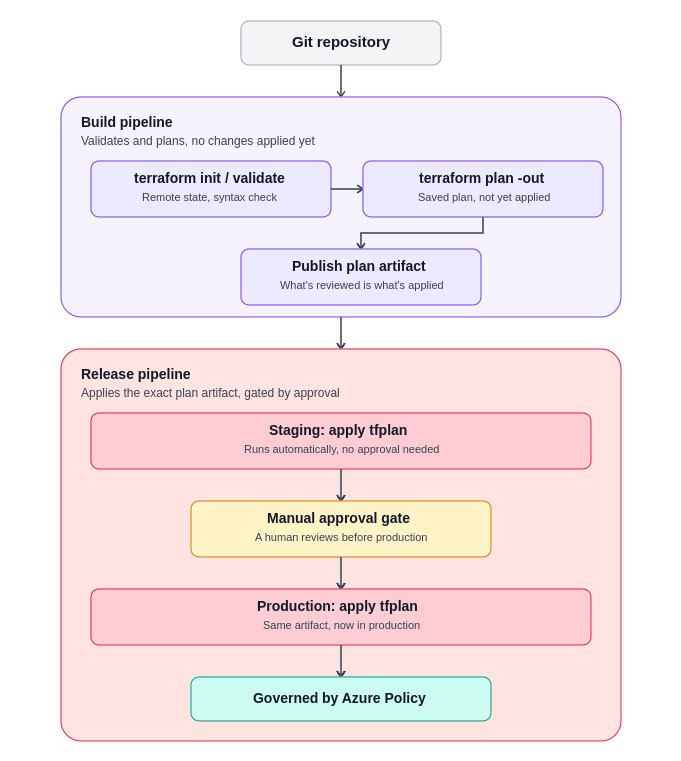
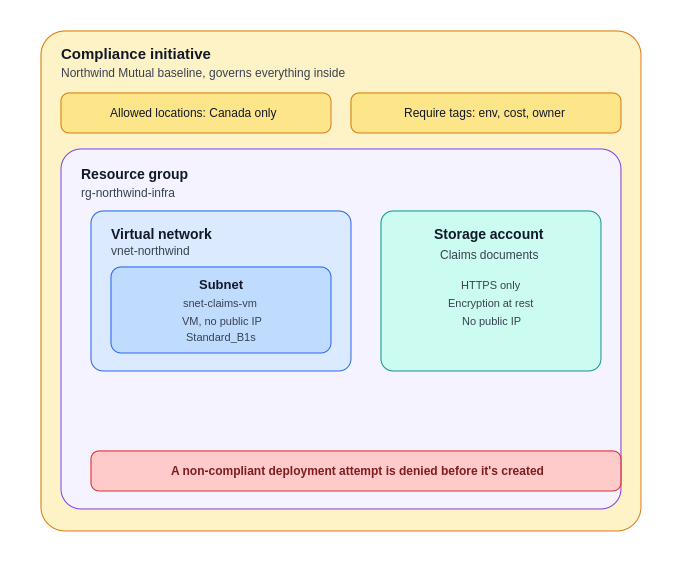

# Northwind Mutual — Compliance-Governed Infrastructure as Code

Terraform + Azure DevOps + Azure Policy, provisioning and governing the base
infrastructure for a fictional insurance claims-processing workload.

> **Disclaimer:** "Northwind Mutual" is a fictional company. All infrastructure,
> naming, and configuration in this project are for personal learning purposes
> only and do not represent or use any real systems, data, or processes from
> any actual insurance company or employer.

---

## What this project demonstrates

Anyone can write Terraform to create a virtual machine. The harder, more
valuable skill is *governing* infrastructure so it can't be created in a
non-compliant way in the first place. This project provisions a small set of
Azure resources using Terraform, deployed through Azure DevOps pipelines with
a human approval gate between plan and apply — and enforces an Azure Policy
compliance initiative on top, modeled on real constraints a Canadian insurer
would care about: data residency, encryption, audit tagging, and network
exposure.

---

## Architecture

### Pipeline flow

The Build Pipeline only ever validates and plans — it never changes real
infrastructure. It runs `terraform init` against the remote state backend,
`terraform validate`, then `terraform plan -out=tfplan`, and publishes that
saved plan file as a pipeline artifact.

The Release Pipeline downloads that exact artifact and applies it — first to
a `staging` Azure DevOps Environment automatically, then it pauses at a
manual approval gate before applying the *same* artifact to a `production`
environment. The plan is never regenerated between staging and production:
what was reviewed is exactly what gets applied. This project uses one real
set of infrastructure with staging/production representing the approval
*workflow*, not two physically separate environments — the same
cost-conscious simplification used for Dev/Staging namespaces in the
companion AKS project.

### Infrastructure and governance structure

The compliance initiative sits as a governing layer around everything else.
It isn't a separate resource you can point at — it's enforced at the
subscription level, which means any attempt to create a resource inside this
resource group that violates a policy (wrong region, missing tags, no
encryption, a public IP) is denied before the resource is ever created, not
flagged afterward.

---

## Infrastructure provisioned

| Resource | Name | Notes |
|---|---|---|
| Resource group | `rg-northwind-infra` | Single resource group for the project |
| Virtual network | `vnet-northwind` | One address space, minimal but real network boundary |
| Subnet | `snet-claims-vm` | The VM's network home; the unit the no-public-IP policy governs |
| Network interface | (unnamed, attached to the VM) | **Deliberately has no public IP** — not a cost shortcut, the more secure and realistic choice; a production VM in a regulated environment is never directly internet-facing |
| Virtual machine | `vm-claims-processor` | `Standard_B1s`, Ubuntu Linux — the cheapest viable size; nothing runs on it, it exists to be governed |
| Storage account | `stnorthwindclaims<unique>` | Standard LRS; represents where claims documents would live |
| Storage container | `claims-documents` | Empty, structural — makes the storage's purpose concrete |

## The compliance initiative

Bundled into one Azure Policy initiative, "Northwind Mutual Compliance
Baseline." Each policy is tied to a stated rationale and a real framework it
maps to:

| Policy | Type | Compliance rationale |
|---|---|---|
| Allowed locations = Canadian regions only | Built-in | Data residency — Canadian insurance data stays in Canada |
| Require tags: Environment, CostCenter, Owner | Custom | Audit trail and cost chargeback (FinOps / SOC 2) |
| Storage: secure transfer (HTTPS) required | Built-in | Data in transit protection (PCI-DSS) |
| Storage: encryption at rest required | Built-in | Data at rest protection (PCI-DSS / NIST) |
| Deny public IP on network interfaces | Built-in/Custom | Network exposure control (NIST 800-53) |

Built-in Azure policies are used wherever one already exists and is
maintained by Microsoft; custom policy is written only for the specific gap
(the tag combination) that no built-in covers. All policies start in **Audit**
mode to confirm the compliance posture, then the enforcement-critical ones
(region, encryption) are switched to **Deny**.

Policies are assigned at **subscription scope** — the pragmatic choice for a
single-subscription trial account. At a larger organization with many
subscriptions, the same policies would typically be assigned at the
management-group level for broader inheritance.

## CI/CD pipelines

- **Build Pipeline** (`pipelines/azure-pipelines-build.yml`) — `terraform init`,
  `validate`, `plan -out=tfplan`, publishes the plan as a pipeline artifact.
  Triggers on push to `main` with changes under `infra/`.
- **Release Pipeline** (`pipelines/azure-pipelines-release.yml`) — downloads the
  plan artifact and runs `terraform apply tfplan`. Manually triggered, not
  automatic — applying infrastructure is a deliberate action, never a side
  effect of a successful plan. Staging applies automatically; production
  requires a human approval in its Azure DevOps Environment.
- **Authentication:** OIDC / Workload Identity Federation — no stored secret
  in either pipeline. A long-lived service-principal secret is exactly the
  kind of credential a security audit at an insurance company would flag.

## State management

Terraform state is stored remotely in Azure Blob Storage (set up once via
`/bootstrap`), never locally. State files can contain secrets and access
tokens in plaintext — in a regulated insurance context, state is treated
with the same rigor as customer PII: encrypted, access-controlled, and
locked against concurrent writes.

---

## Cost-conscious design

_(filled in at project completion — same before/after-session discipline as
the companion AKS project: confirm baseline cost, tear down `terraform
destroy` after each session, verify resource groups empty)_

## What a production setup would add

_(deliberately deferred — filled in at project completion: private endpoints
on the state storage account, management-group-scope policy assignment,
IaC security scanning with Checkov/tfsec, drift detection, DeployIfNotExists
remediation policies)_